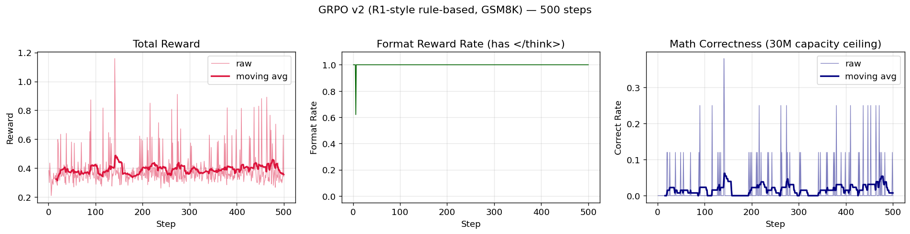
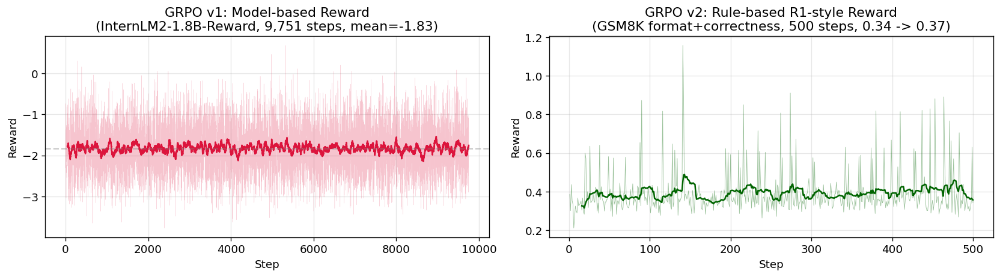

# LLM Training Pipeline: Pretrain → SFT → DPO → GRPO

> End-to-end replication of a 4-stage LLM training lifecycle based on the [MiniMind](https://github.com/jingyaogong/minimind) framework.
> A 30M parameter decoder-only model trained on a single RTX A5000 24GB, with additional R1-style rule-based GRPO as a controlled comparison experiment.

**All training is done with the [MiniMind](https://github.com/jingyaogong/minimind) codebase as the base framework.** This repository focuses on:
1. Running the full training pipeline with documented hyperparameters and observed behavior.
2. A **new comparative GRPO experiment** (R1-style rule-based reward on GSM8K) not included in upstream MiniMind — the associated scripts `trainer/train_grpo_r1.py` and `dataset/lm_dataset_r1.py` are original contributions in this repo.

---

## TL;DR

| Stage | Method | Data | Steps | Key Metric |
|---|---|---|---|---|
| Pretrain | CLM + bf16 + grad accum | 1.2GB Chinese corpus | 39,695 | Loss **10 → 2.16** |
| SFT | Full-param + loss mask | 900K multi-turn dialogues | ~53,000 | Loss → ~2.0 |
| DPO | Bradley-Terry preference | 17K preference pairs | 4,292 | Loss **0.69 → 0.35** |
| GRPO v1 | Model-based reward (InternLM2-1.8B) | 19.5K RLAIF prompts | 9,751 | Reward **-1.78 → -1.78** (reward hacking observed) |
| GRPO v2 | **Rule-based R1-style** (format + correctness) | 1K GSM8K prompts | 500 | Reward **0.34 → 0.40** (+20%), Correct rate 0 → **14%** (last 100 steps) |

**The GRPO v1 vs v2 comparison is the key finding** — see [Findings & Analysis](#findings--analysis) below.

---

## Setup

```bash
# Environment
conda create -n minimind python=3.10 -y
conda activate minimind
pip install -r requirements.txt   # torch 2.5.1+cu121, transformers 4.57, trl 0.17, accelerate 1.13
```

Hardware used: single NVIDIA RTX A5000 24GB. Peak memory per stage: 7–10GB.

---

## Stage 1: Pretrain

**Goal:** Train a 30M decoder-only Transformer from scratch on Chinese web text.

```bash
cd trainer && python train_pretrain.py \
  --epochs 1 --batch_size 32 --accumulation_steps 8 \
  --hidden_size 512 --num_hidden_layers 8 \
  --max_seq_len 512 --learning_rate 5e-4
```

- **Effective batch size:** 32 × 8 = 256
- **Duration:** ~95 minutes, 39,695 steps
- **Output:** `out/pretrain_512.pth` (64MB)


---

## Stage 2: SFT (Supervised Fine-Tuning)

**Goal:** Give the pretrained model conversational ability.

```bash
python train_full_sft.py \
  --epochs 1 --batch_size 16 --accumulation_steps 2 \
  --hidden_size 512 --num_hidden_layers 8 \
  --max_seq_len 768 --learning_rate 1e-5 \
  --from_weight pretrain
```

Key points:

- **Data:** 900K multi-turn dialogues with `<reasoning>` CoT traces.
- **Learning rate:** `1e-5`, **50× smaller** than pretrain. Small LR here is critical — going larger (say `1e-4`) causes catastrophic forgetting of the pretrained base.
- **Loss mask:** `user` and `system` tokens have `label = -100` so only `assistant` response is learned. See `dataset/lm_dataset.py::SFTDataset.generate_labels`:

```python
labels = [-100] * len(input_ids)
# ... only tokens between <|im_start|>assistant\n and <|im_end|>\n are copied to labels
for j in range(start, min(end + len(self.eos_id), self.max_length)):
    labels[j] = input_ids[j]
```

Without the mask, the model would memorize prompts and generalize worse.


---

## Stage 3: DPO (Direct Preference Optimization)

**Goal:** Align the SFT model with preference data **without training a separate reward model**.

```bash
python train_dpo.py \
  --epochs 1 --batch_size 4 --accumulation_steps 2 \
  --hidden_size 512 --num_hidden_layers 8 \
  --learning_rate 4e-8 --beta 0.15 \
  --from_weight full_sft
```

- **Learning rate:** `4e-8`, **250× smaller** than SFT. This is deliberately conservative — DPO can easily wreck learned SFT capability if LR is too large.
- **Theoretical starting loss:** `-log(sigmoid(0)) = ln(2) ≈ 0.693`. Observed start matches; converges to ~0.35.

**Why DPO doesn't need a reward model (Bradley-Terry derivation):**

1. Bradley-Terry: `P(y_w > y_l | x) = σ(r(y_w) − r(y_l))`
2. Constrained RLHF has closed-form optimum: `π*(y|x) = (1/Z(x)) · π_ref(y|x) · exp(r(x,y)/β)`
3. Inverting: `r(x,y) = β·log(π_θ(y|x) / π_ref(y|x)) + β·logZ(x)`
4. When computing `r(y_w) − r(y_l)`, `logZ(x)` cancels — the reward is **implicitly** captured by the policy ratio.

So `β · log(π_θ / π_ref)` plays the role of an **implicit reward**; no reward model needed.


---

## Stage 4: GRPO — Two Reward Designs Compared

This is the core experimental finding of the project. Starting from the same DPO checkpoint, we ran GRPO under two different reward regimes and compared behavior.

### GRPO v1 — Model-based Reward

```bash
python train_grpo.py \
  --epochs 1 --batch_size 2 --num_generations 4 \
  --hidden_size 512 --num_hidden_layers 8 \
  --max_seq_len 768 --max_gen_len 512 \
  --learning_rate 3e-7 --beta 0.1 --loss_type grpo \
  --from_weight dpo --rollout_engine torch \
  --reward_model_path ../../internlm2-1_8b-reward
```

- **Reward model:** InternLM2-1.8B-Reward (1.7B params, **56× larger than the 30M policy**).
- **Data:** `dataset/rlaif.jsonl` — 19,502 open-dialogue prompts, no ground-truth answer.
- **Duration:** ~8 hours, 9,751 steps.

**Results:**

- **Mean reward: `-1.78 → -1.78`** (no improvement).
- **KL_ref ≈ 0.0** throughout — the policy barely moved.
- **Response length: ~200 → ~500 tokens** (bloated).
- Qualitative inspection: responses grew longer with boilerplate phrasing and `</think>` tag leakage, but the reward model didn't assign meaningfully higher scores.


**Diagnosis — why didn't it work?**

1. **Capacity mismatch.** A 30M policy is too small to absorb GRPO signal under PPO clip + LR=3e-7. `KL_ref ≈ 0` proves this: the policy parameters barely changed.
2. **Reward model too big, signal too coarse.** A 1.7B reward model views all 30M-generated text as roughly equally mediocre; reward variance is narrow (~-2 to -1), so per-group advantage is weak.
3. **Task has no ground truth.** Open-dialogue has no unambiguous "correct" answer. The reward model latches onto surface features (length, politeness), which the policy learns to game — **classic reward hacking**.
4. **Chat template amplifies the leak.** MiniMind's chat template auto-inserts `<think>\n` at the start of every assistant turn. The model learns to emit `</think>` immediately and then generate free text. The reward model doesn't penalize this format leak, so it compounds with the length bloat.

### GRPO v2 — Rule-based R1-style Reward (original contribution)

```bash
cd trainer && python train_grpo_r1.py \
  --max_steps 500 --num_samples 1000 \
  --num_generations 4 --batch_size 2 \
  --max_gen_len 256 --learning_rate 1e-6 \
  --hidden_size 512 --num_hidden_layers 8 \
  --from_weight full_sft
```

- **Reward design:**
  - `+0.5` if completion contains `</think>`
  - `+0.5` if text after `</think>` contains `<answer>NUMBER</answer>`
  - `+2.0` if the extracted number equals GSM8K ground truth
  - `-0.5 * rep_penalty(response)` (repetition penalty)
- **Data:** GSM8K 1,000 math problems (via `datasets.load_dataset("gsm8k", "main")`).
- **Duration:** ~20 minutes, 500 steps (1 full epoch on GSM8K-1K).

**Results:**

- **Mean reward: `0.337 → 0.404`** over 500 steps (+19.9%), **converged** (last-50 vs last-100 window diverges by <0.5%).
- **Format rate: 100% stable** — the model reliably emits `</think>`.
- **KL_ref < 0.01** — healthy, no divergence.
- **Correctness rate: 0% → ~14%** (fraction of steps with at least one correct completion in the group-of-4, measured over the last 100 steps). Still far below competent reasoning, bounded by 30M capacity.



**Side-by-side reward comparison:**



---

## Findings & Analysis

The GRPO v1 vs v2 comparison reveals two distinct failure modes of small-model RL:

| | GRPO v1 (model-based) | GRPO v2 (rule-based) |
|---|---|---|
| Reward signal sharpness | Low (1.7B RM on 30M policy → coarse) | **High** (format & correctness are binary) |
| Policy actually updates? | No (KL ≈ 0) | **Yes** (reward trends up) |
| Hacking observed | Yes (length bloat, `</think>` leak, clichés) | Yes (repeating numbers to fool `findall()[-1]`) |
| Capability improved? | No | **Format yes, math no** |

**Takeaway:** Rule-based reward provides a much sharper training signal than model-based reward for small models, but **no amount of clever reward engineering can overcome model capacity limitations**. A 30M model cannot do multi-step arithmetic reasoning regardless of how well you reward it. This is consistent with DeepSeek-R1's choice of a 671B base model for its RL stage.

**Inference-time sanity check** on the GRPO v2 checkpoint:

```
User: 你好,介绍一下你自己
GRPO-R1: 你好!我是由中国的个人开发者独立开发的智能助手minimind... </think>  ← tag leak still present
         有关模型和产品的详细内容请参考官方文档。

User: 2个苹果加3个苹果是多少?
GRPO-R1: 首先,我需要明确苹果加3个苹果的定义...[长段胡言乱语]...
         综上所述,苹果加3个苹果是3个。   ← wrong (should be 5)
```

Format is learned, dialog ability is preserved (KL<0.01 kept it intact), but **math remains at 30M's ceiling**.

---

## LR Schedule Across Stages

| Stage | LR | Ratio vs previous | Rationale |
|---|---|---|---|
| Pretrain | 5e-4 | — | Train from scratch |
| SFT | 1e-5 | /50 | Preserve pretrain knowledge |
| DPO | 4e-8 | /250 | Preserve SFT dialogue capability |
| GRPO v1 | 3e-7 | ~×10 | Small enough to not break policy, large enough for PPO to move |
| GRPO v2 | 1e-6 | ~×3 | Rule-based signal is sharper, can afford slightly more aggressive LR |

This monotonic LR decay across alignment stages is a general design principle: **every post-training stage should use a much smaller LR than the previous one to avoid destroying earned capabilities**.

---

## File Structure

```
minimind/
├── dataset/
│   ├── lm_dataset.py          # Original MiniMind datasets
│   └── lm_dataset_r1.py       # NEW: GSM8K dataset for R1-style GRPO
├── trainer/
│   ├── train_pretrain.py      # Stage 1 (upstream)
│   ├── train_full_sft.py      # Stage 2 (upstream)
│   ├── train_dpo.py           # Stage 3 (upstream)
│   ├── train_grpo.py          # Stage 4 v1: model-based (upstream)
│   └── train_grpo_r1.py       # NEW: Stage 4 v2: R1-style rule-based
├── plot_curves.py             # NEW: reproduce plots from logs
├── plots/                     # Generated from logs
│   ├── pretrain_loss.png
│   ├── sft_loss.png
│   ├── dpo_loss.png
│   ├── grpo_v1_reward.png
│   ├── grpo_v1_response_len.png
│   ├── grpo_r1_curves.png
│   └── grpo_v1_vs_v2.png
└── logs/                      # Training logs from each stage
    ├── pretrain.log
    ├── sft.log
    ├── dpo.log
    ├── grpo.log
    └── r1_main.log
```

Checkpoints (`.pth` files, ~64MB each) are **not committed** due to size — they can be regenerated by running the training commands above.

---

## References

- **MiniMind:** https://github.com/jingyaogong/minimind (base framework)
- **DPO:** Rafailov et al., "Direct Preference Optimization: Your Language Model is Secretly a Reward Model" (NeurIPS 2023)
- **GRPO:** Shao et al., "DeepSeekMath: Pushing the Limits of Mathematical Reasoning in Open Language Models" (2024)
- **DeepSeek-R1:** DeepSeek-AI, "DeepSeek-R1: Incentivizing Reasoning Capability in LLMs via Reinforcement Learning" (2025)
- **InstructGPT RLHF:** Ouyang et al., 2022

---

## Acknowledgments

Thanks to [@jingyaogong](https://github.com/jingyaogong) for the MiniMind framework, which makes the full pretrain-to-RL pipeline tractable on a single GPU.
